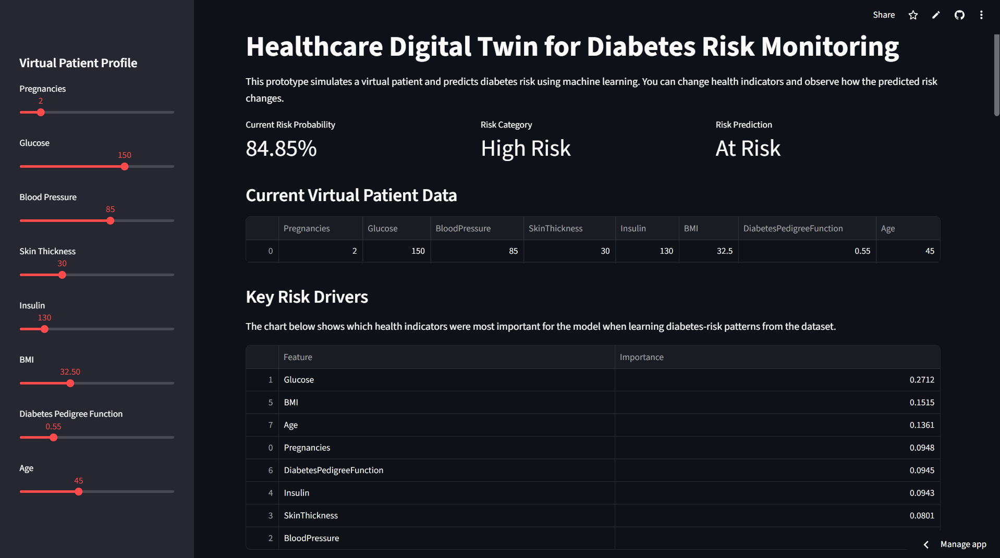
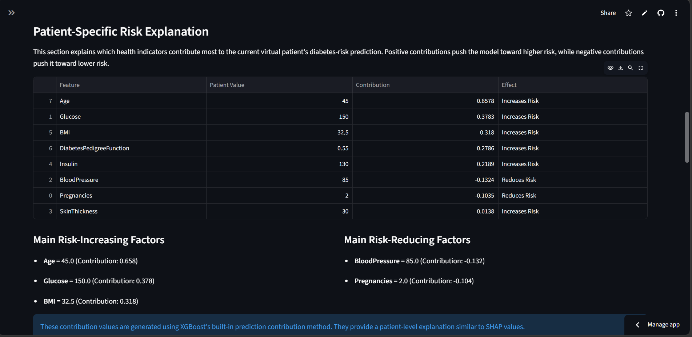
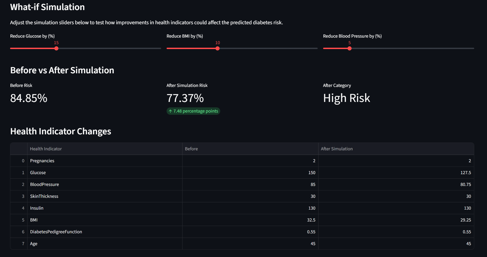
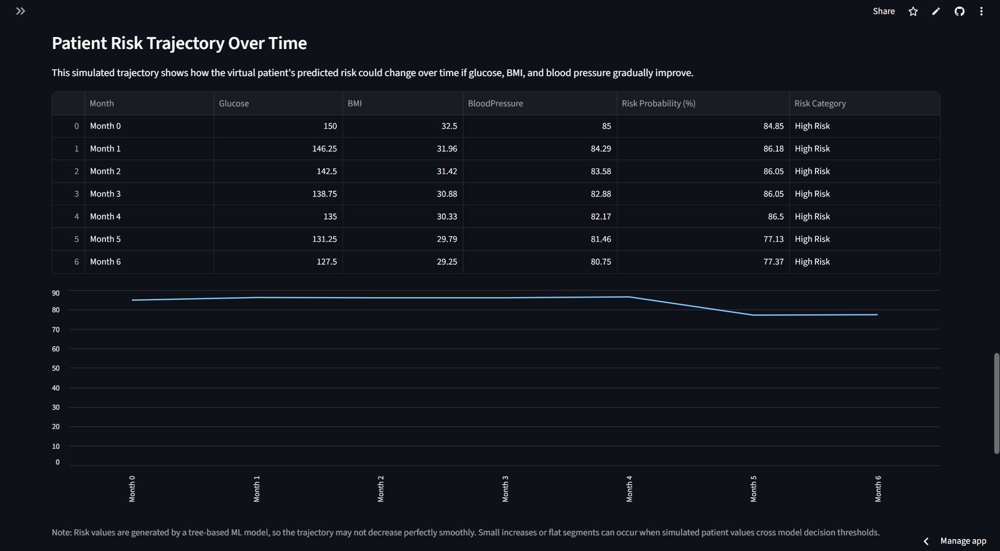
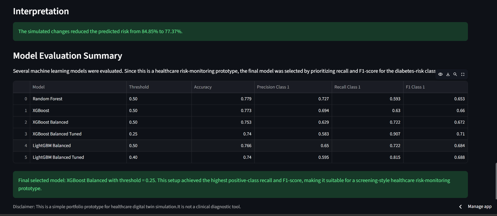

# Healthcare Digital Twin for Diabetes Risk Monitoring

An interactive healthcare AI prototype that uses machine learning, digital twin simulation, and model explainability to estimate and visualize patient-specific diabetes risk.

This project demonstrates how clinical indicators such as glucose, BMI, blood pressure, insulin, age, and diabetes pedigree function can be used to create a virtual patient profile, predict diabetes risk, simulate health improvements, and explain the factors influencing the prediction.

---

## Project Overview

Diabetes risk monitoring is an important healthcare challenge because early identification of high-risk patients can support preventive care, lifestyle intervention, and clinical decision-making.

This project builds a simplified **healthcare digital twin prototype** for diabetes risk monitoring. The digital twin represents a virtual patient using clinical health indicators and allows users to simulate how changes in those indicators may affect the model-predicted diabetes risk.

The goal is not to create a clinical diagnostic tool, but to demonstrate how machine learning and digital twin concepts can support transparent, interactive, and data-driven healthcare risk analysis.

---

## What Problem Does This Project Solve?

Traditional machine learning healthcare projects often stop at:

> Input patient data → predict disease risk

This project goes further by adding simulation and explainability:

> Virtual patient profile → risk prediction → what-if simulation → risk trajectory → explanation of risk drivers

The dashboard allows users to answer questions such as:

- What is the current predicted diabetes risk for this virtual patient?
- Which health indicators contribute most to the risk prediction?
- How would predicted risk change if glucose, BMI, or blood pressure improved?
- How could risk evolve over time under a simulated health-improvement scenario?
- Why did the model classify the patient as low, medium, or high risk?

---
## Key Features

### 1. Diabetes Risk Prediction

The model predicts the probability that a patient belongs to the diabetes-risk class.

The output is shown as:

- Risk probability
- Risk category
- Risk prediction label
  
| Probability Range | Risk Category |
| ----------------- | ------------- |
| Below 25%         | Low Risk      |
| 25% to 60%        | Medium Risk   |
| 60% and above     | High Risk     |

### 2. What-if Simulation

The dashboard allows users to simulate health improvements by adjusting glucose, BMI, and blood pressure. The system then recalculates the predicted diabetes risk and compares:
- Before and After Simulation risk
- Risk reduction in percentage points
- Before and After risk category

### 3. Patient Risk Trajectory

The project shows how the predicted risk may change over six months under a selected improvement scenario. It assumes a gradual linear improvement over six months. This allows the dashboard to show how the model-predicted risk may evolve over time under a selected what-if scenario.

Because the final model is tree-based, the risk trajectory may not always decrease perfectly smoothly. Small increases or flat segments can occur when simulated values cross model decision thresholds.

### 4. Model Explainability

The project includes feature importance, SHAP analysis in the notebook, and patient-level risk contribution explanations. 
This helps answer why did the model predict this risk level?

### 5. Model Evaluation and Threshold Tuning

Several models were trained and compared:
- Logistic Regression
- Decision Tree
- Random Forest
- XGBoost
- Balanced XGBoost
- LightGBM
- Balanced LightGBM

and the final model was selected based on recall and F1-score for diabetes-risk detection rather than accuracy alone.

The final selected model was:

> Balanced XGBoost with custom decision threshold = 0.25

This threshold was chosen because it improved the model’s ability to detect diabetes-risk cases.

---
## Digital Twin Concept

In this project, the digital twin is a simplified virtual representation of a patient.

It combines:

1. Patient health indicators  
2. A machine learning risk prediction model  
3. What-if simulation  
4. Risk trajectory over time  
5. Model interpretability  

The digital twin allows users to test simulated changes before they happen in real life.

Example:

```text
Current virtual patient:
Glucose = 150
BMI = 32.5
Blood Pressure = 85

Predicted diabetes risk = High

Simulation:
Reduce glucose by 15%
Reduce BMI by 10%
Reduce blood pressure by 5%

Updated predicted diabetes risk = Low / Medium / High depending on the model output.
```

---

## Dataset
This project uses the Pima Indians Diabetes dataset.

The dataset contains indicators such as:

- Pregnancies
- Glucose
- Blood pressure
- Skin thickness
- Insulin
- BMI
- Diabetes pedigree function
- Age
- Diabetes outcome

Target variable included:
| Value | Meaning     |
| ----- | ----------- |
| 0     | No diabetes |
| 1     | Diabetes    |

---

## Data Cleaning
Some columns contained medically unrealistic zero values. For example, glucose, blood pressure, insulin, and BMI should not realistically be zero.

The following columns were cleaned:

- Glucose
- BloodPressure
- SkinThickness
- Insulin
- BMI

Zero values were replaced with missing values and then filled by using the median value of each column.

This step improved the reliability of the dataset before model training.


---
## Tech Stack
- Python
- Pandas
- Numpy
- Scikit-learn
- XGBoost
- LightGBM
- SHAP
- Matplotlib
- Streamlit
- Joblib


---
## Dashboard Screenshots

### Main Dashboard and Risk Prediction


### Patient-Specific Risk Explanation


### What-if Simulation


### Patient Risk Trajectory


### Model Evaluation and Interpretation Summary



---
## How to Run the Project Locally
1. Clone the repository
2. Create and activate environment
3. Install dependencies
4. Run the Streamlit app
---
## Live Demo
[LIVE_DEMO_LINK](https://healthcare-digital-twin-peggpz822n6qnoievcfdyb.streamlit.app/)

---
## Limitations
This project is a student portfolio prototype and should not be used for clinical diagnosis.

Important limitations:

- The dataset is small and may not represent diverse populations.
- The model is trained on historical tabular data, not real-time patient monitoring data.
- The what-if simulation is based on model-estimated risk, not medical causality.
- The risk trajectory assumes gradual linear improvement, which may not reflect real patient behavior.
- Predictions should support analysis, it should not replace medical professionals.
  
---

## Future Improvements
Possible future extensions include:

- Use larger and more diverse healthcare datasets
- Add real patient time-series monitoring data
- Include additional clinical indicators
- Add SHAP plots directly inside the dashboard
- Deploy the app on Streamlit Community Cloud
- Add user authentication for personalized patient profiles
- Generate downloadable PDF reports
- Add Docker support
- Integrate anomaly detection for real-time monitoring
- Extend the digital twin concept to cardiovascular or multi-disease risk monitoring
  
---
## Disclaimer
This project is for educational learning and portfolio purposes only.

It is not a medical device, diagnostic system, or clinical decision-making tool. Any healthcare-related predictions should be validated by qualified medical professionals and tested on clinically appropriate datasets before real-world use.

---
## Author
Saizel Pathania

Master’s Student in Data Science


TU Dortmund University

[LinkedIn](https://linkedin.com/in/saizel-pathania)


[ORCID](https://0009-0004-8742-3846)
